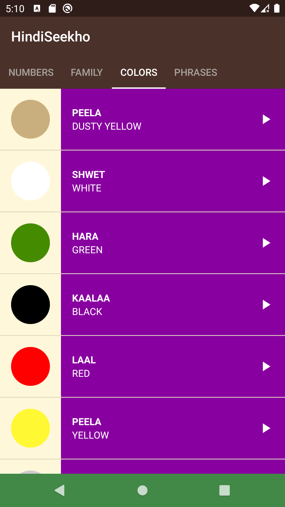

# Hindi Seekho
## Made by Snehil Kumar

>A Hindi Language Learning App For Kids

When each list item, i.e., a word or sentence is touched, the app plays its Hindi pronunciation.

Below are the screenshots of the App:

  

